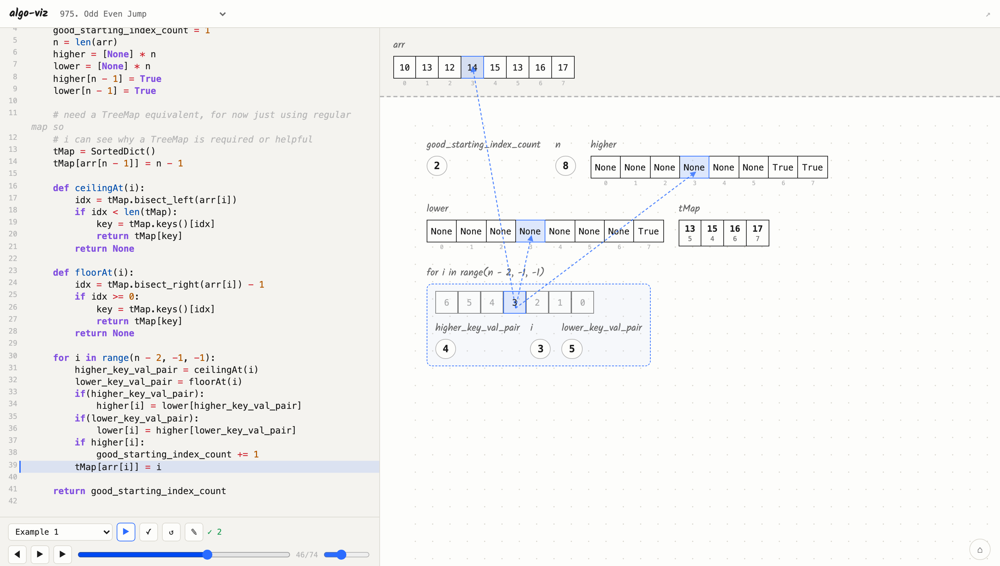

# algo-viz

A learning tool for algorithm problems: write a real Python solution, run it
against a test case, then **step or scrub through the actual execution** —
every variable renders on an infinite canvas exactly as your code produced
it, live. No canned animations, no problem-specific scripting. Built to
double as a clean recording surface for LeetCode explainer videos (the
scrubber is your video timeline).



## How it works

`backend/tracer.py` runs your submitted code under `sys.settrace`,
snapshotting every local variable at every executed line. The frontend just
replays that list of snapshots. Because nothing is hardcoded to a specific
problem's variable names, the same engine renders whatever *you* name:

- A list named `stack` (or anything with "stack" in it) renders as a LIFO
  tower of blocks, with an empty-state icon before anything's pushed.
- Any other list renders as a single rectangle divided into cells — a
  `dict` (including a `sortedcontainers.SortedDict`) renders as a live
  sorted key/value strip.
- A `for`/`while` loop gets its own dashed container that appears only
  while execution is actually inside it, holding a small "what will this
  run through" preview (the real sequence for a `for x in some_list:`, the
  actual index countdown for `range(a, b, c)`, or a plain counter as a
  fallback) plus whichever variables were first bound inside that loop.
  Leave the loop and its box — and everything scoped to it — disappears;
  step back in and it's rebuilt.
- If a loop's own index variable is used to subscript an array directly
  (`arr[i]`, found via a plain AST scan, no need to step into a helper
  function that does it), a line is drawn from the loop's current position
  to that array's matching cell, live.
- Function parameters stay pinned in their own strip above the canvas,
  separate from everything the algorithm computes — and every value there
  is click-to-edit, so you can hand-author a test case without touching
  the test dropdown.

None of this is per-problem configuration. It falls out of watching what
the trace actually contains at each step.

## Run it

```bash
cd algo-viz
python3 -m venv .venv          # first time only
source .venv/bin/activate
pip install -r requirements.txt
python3 backend/server.py
```

Then open http://127.0.0.1:5057

## Using it

1. Pick a test case, hit **Run & Visualize**.
2. Use the scrubber or step buttons to move through execution. Play/pause
   with adjustable speed for recording.
3. **Run All Tests** checks your solution against every official test case
   without the step-by-step overhead — a quick correctness check while
   iterating.
4. Edit the code any time — double-click the code panel (once a run has
   highlighted a line) to go back to editing, tweak something (e.g. remove
   the `+ 1` in `exclusiveTime`'s `end` branch to reproduce a classic
   off-by-one), and re-run to see exactly where the result diverges.
   Edits are saved per problem in the browser's local storage as you type,
   so reloading the page or switching problems and back won't discard your
   changes. **Reset** clears that saved copy and goes back to the original
   starter code.
5. Drag any shape — an array, a stack, a loop box — anywhere on the
   canvas. It snaps into alignment with a neighboring shape's edges or
   center as you get close, so you can, say, stack two same-sized arrays
   directly on top of each other for an easy element-by-element
   comparison. A dragged position sticks for the rest of that run
   (surviving stepping, scrubbing, and a loop box being torn down and
   rebuilt each time you re-enter the loop) and resets to the automatic
   layout the next time you hit Run.

## Project layout

```
algo-viz/
├── backend/
│   ├── server.py            Flask app: serves the frontend + two JSON endpoints
│   ├── tracer.py            the execution engine — sys.settrace + AST loop analysis
│   └── problems/
│       ├── exclusive_time.py    LeetCode 636
│       └── odd_even_jump.py     LeetCode 975
├── frontend/
│   ├── index.html
│   ├── app.js                the canvas renderer, drag/snap, loop + connector logic
│   └── style.css
├── docs/screenshot.png
├── requirements.txt
└── README.md
```

Everything shown in the browser comes from one of two JSON endpoints:
`GET /api/problems/<id>` (the static problem definition) and
`POST /api/run` (one traced execution, plus the AST loop analysis for that
run). `app.js` owns all rendering — there's no build step, no framework,
just the DOM.

## Adding another problem

Drop a new file in `backend/problems/`, e.g.
`backend/problems/valid_parentheses.py`, exporting a `PROBLEM` dict shaped
like the one in `exclusive_time.py` (`id`, `title`, `leetcode_url`,
`func_name`, `arg_names`, `description`, `starter_code`, `tests`). It shows
up in the problem dropdown automatically — the array/stack/map/scalar/loop
rendering is fully generic, so no frontend changes are needed unless a
problem needs a genuinely new representation (a tree or graph, say).

## Notes / current limits

- Recursion is traced (a recursive call to the *same* function keeps
  tracing normally), but a nested helper function the solution defines
  internally (a custom bisect helper, say) is deliberately stepped over,
  not into — its internals would just fragment the visualization of the
  algorithm's own state. Its return value still flows back normally.
- The loop → array index connector only fires for a `for` loop with a
  simple index variable (`for i in ...`), not a tuple target
  (`for k, v in ...`) or a `while` loop.
- Execution is capped at 20,000 traced steps / 5 seconds, to guard against
  an infinite loop in whatever you paste in.
- This is a local, single-user tool — the Flask dev server runs with the
  debugger on and no auth. Don't expose it beyond localhost.
- It does not submit to LeetCode; it's a practice/explanation tool.

## License

MIT — see [LICENSE](LICENSE).
